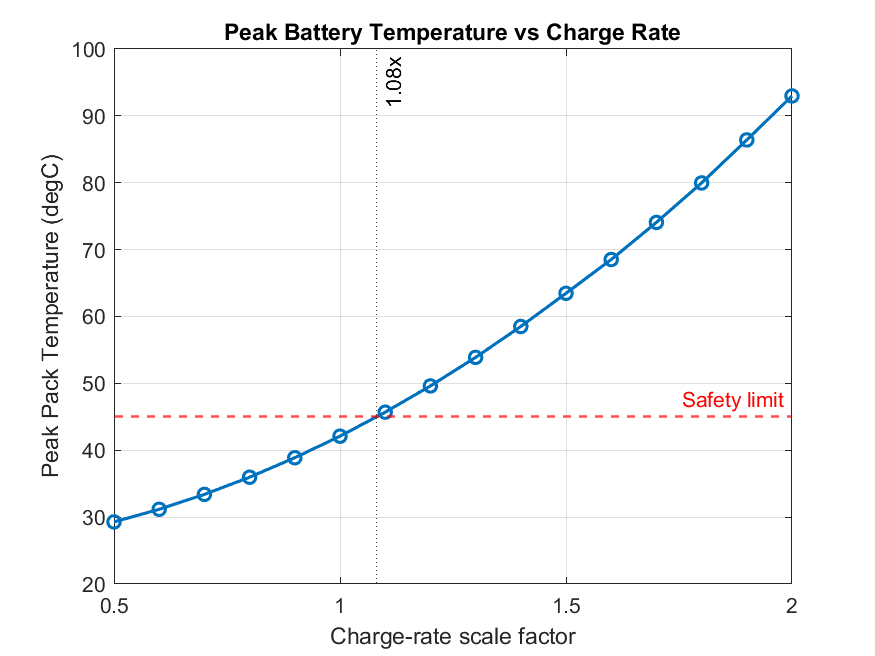

# EV Battery Thermal Management (BTMS) Optimizer — Transient Fast-Charge Analysis

A Simscape + MATLAB model of an EV battery pack undergoing a real-world DC fast-charging session, built to answer one question: **how aggressively can this pack be charged before passive cooling can no longer keep peak temperature inside a safe limit?**

This is Project 2 of a thermal-systems portfolio series. Project 1 (data center CPU cooling, steady-state optimization) is available [here](https://github.com/jkevinthomas4321/cooling-thermal-optimizer) — this project deliberately shifts from a steady-state problem to a **transient** one, where the constraint that matters is the *peak* temperature reached during a time-varying event, not the eventual steady-state value.

---

## TL;DR

- Modeled a Tesla Model 3 pack (480 kg, 96S46P, 52.2 mΩ) under its real 250 kW V3 Supercharger curve, using a validated lumped-thermal-capacitance Simscape model with ohmic (I²R) heat generation.
- **Baseline peak temperature: 42.10°C** — safely under a 45°C threshold, but not by much.
- **The pack can tolerate ~1.08× today's real charge curve before crossing 45°C** under passive (parked, no forced-air) cooling — the real-world curve is already close to the practical ceiling.
- Sensitivity testing found the specific-heat assumption (unsourced in public data) swings the answer by **~13°C** — more than a 20% resistance error does. That's the flagged, top-priority uncertainty in this model.



---

## 1. Motivation

Most battery thermal analyses default to steady-state heat balances. Real fast-charging sessions aren't steady-state — power ramps up, holds near a peak, and tapers down as the pack approaches full charge. A model that only checks the "final" or "average" temperature can miss a transient overshoot that happens mid-session, which is exactly the failure mode that matters for real battery safety: Li-ion degradation and thermal-runaway risk are driven by peak cell temperature, not average temperature.

This project builds a validated lumped-thermal-mass model of a real EV pack, drives it with a real digitized DC fast-charge power curve, and uses it to find the practical charge-rate ceiling for passive (natural-convection) air cooling — and to quantify how much that answer depends on modeling assumptions that aren't fully pinned down by public data.

---

## 2. Real-world grounding: Tesla Model 3 Long Range

Rather than use round, made-up numbers, this model is built from published specs and a third-party engineering teardown report:

| Parameter | Value | Source |
|---|---|---|
| Usable pack energy | 75–82 kWh | Manufacturer specifications |
| Pack mass | ~480 kg | Third-party pack teardown estimate |
| Pack topology | 96 cells in series × 46 in parallel (96S46P) | Ricardo Engineering module teardown |
| Cell format | 21700 cylindrical, NCA chemistry | Ricardo Engineering teardown |
| Cell internal DC resistance | 25 mΩ @ 30°C | Ricardo Engineering teardown |
| Peak DC fast-charge power | 250 kW (V3 Supercharger) | Public V3 Supercharger test data |
| Charge curve shape | 126 kW @ 2% SOC → 250 kW held 5–20% SOC → tapering to 56 kW @ 80% SOC | Digitized real-world V3 charge test |
| Nominal pack voltage | 350 V | Manufacturer specifications |

**Derived pack resistance:**

$$R_{pack} = R_{cell} \times \frac{N_{series}}{N_{parallel}} = 25\text{m}\Omega \times \frac{96}{46} \approx 52.2\text{ m}\Omega$$

Cross-validated against an independently measured DCIR (~46.1 mΩ) on a different Tesla pack with a different parallel-cell count — same order of magnitude, correct directional relationship (more parallel paths → lower resistance), which supports the derivation.

---

## 3. Physics

### 3.1 Heat generation: ohmic (I²R) loss, not a flat efficiency factor

Battery heat generation during charging is dominated by ohmic loss inside the pack's internal resistance:

$$\dot{Q}_{gen}(t) = I(t)^2 \, R_{pack}, \qquad I(t) = \frac{P(t)}{V_{nominal}}$$

This is a deliberate choice over a simpler constant-efficiency model ($\dot Q = (1-\eta)P$). Ohmic loss scales with the **square** of current, while a flat-efficiency model scales linearly with power — meaning a flat-efficiency model would understate heat generation during the 250 kW peak-power hold and overstate it during the low-power taper. Since this project's core question is specifically about *peak-power risk*, preserving the quadratic relationship is essential to the result, not a stylistic preference.

### 3.2 Why peak temperature — not steady-state — is the real constraint

A CPU that overheats throttles or shuts down. A Li-ion cell has no equivalent graceful failure mode: elevated temperature accelerates irreversible degradation (SEI layer growth), and beyond a chemistry-dependent threshold, risks thermal runaway — a self-sustaining exothermic reaction. This is why the constraint modeled here is "never exceed X, even momentarily," and why the entire sweep in Section 6 is built around locating a peak-temperature crossing point, not a steady-state one.

### 3.3 Thermal model

Single-node lumped capacitance model:

$$C\frac{dT}{dt} = \dot{Q}_{gen}(t) - UA\,(T - T_{amb})$$

implemented in Simscape as a Thermal Mass block, fed by a time-varying heat source (`From Workspace`), losing heat to ambient through a Convective Heat Transfer block.

---

## 4. Modeling assumptions (explicitly flagged)

Every assumption below was a genuine, documented decision point during development — not a silent default:

| Assumption | Value used | Why it matters |
|---|---|---|
| Cooling mode | Passive air convection only, UA = 600 W/K (h≈100 W/m²K, A≈6 m²) | Charging occurs while the car is parked — forced convection can't be assumed. This also means the model has no liquid-coolant loop; "flow rate" optimization was replaced with a charge-rate ceiling analysis (see Section 6). |
| Pack voltage | Fixed at 350 V (nominal) | Real pack voltage rises ~320V→396V with SOC. A fixed value simplifies the current calculation but is a stated approximation, not measured behavior. |
| Charge-rate scaling | Real curve scaled uniformly (0.5x–2.0x) to represent more/less aggressive charging | A uniform scale is a proxy, not a physically accurate re-derivation of what a higher-power charger's curve would actually look like. |
| Specific heat capacity | Tested at two literature-bounded values (320 and 1000 J/kg·K) | No single sourced value exists for whole-pack effective specific heat; Section 6.3 quantifies the resulting spread in the answer rather than picking one value silently. |

---

## 5. Validation

Before any sweep was trusted, the single-run model was validated against hand calculations at three levels:

1. **Zero-input test** — heat input set to zero; pack temperature held flat at 25°C ambient for the full simulated duration. Confirms no spurious heat leak/injection in the thermal network wiring.
2. **Step-input test** — constant 1000 W heat input. Simulated steady-state temperature matched the hand-calculated value ($\Delta T = Q/UA = 1000/600 \approx 1.67°C$ → 26.67°C) and the time constant matched $\tau = C/UA = 800\text{s}$.
3. **Full transient hand-check** — peak heat generation (26,619 W at 250 kW charge power) cross-checked against $I^2R$ by hand before trusting the simulated 42.10°C baseline peak.

A unit bug (model reporting temperature in Kelvin, silently off by 273.15) was caught during this process precisely because the hand-calculated bound (~20–45°C plausible range) didn't match an initial simulated result of 315°C — a useful real example of why bounding a result before trusting it matters.

---

## 6. Results

### 6.1 Baseline run

At the real, unscaled Tesla V3 charge curve: **peak pack temperature = 42.10°C**, comfortably under a 45–60°C safety range for this chemistry.

### 6.2 Charge-rate sweep — the core result


Peak temperature rises smoothly and monotonically with charge-rate scale factor. Using a 45°C safety threshold, **the modeled passive-air-cooled pack can tolerate charging up to approximately 1.08× the real Tesla V3 curve before exceeding that limit** — i.e., the real-world curve already sits close to the practical ceiling for air-only cooling.

| Scale | Peak Temp (°C) | Scale | Peak Temp (°C) |
|---|---|---|---|
| 0.5x | 29.28 | 1.4x | 58.51 |
| 0.7x | 33.40 | 1.6x | 68.52 |
| 0.9x | 38.88 | 1.8x | 79.97 |
| 1.0x | 42.10 | 2.0x | 92.98 |
| 1.2x | 49.62 | | |

### 6.3 Sensitivity analysis

| Parameter varied | Range tested | Resulting peak temp range | Interpretation |
|---|---|---|---|
| Pack resistance (R_pack) | ±20% | 38.71 – 45.52°C | Roughly ±3.4°C — moderate, physically expected linear sensitivity |
| Specific heat (c_p) | 320 vs 1000 J/kg·K | 42.10 – 55.00°C | **~13°C swing** — the single largest source of uncertainty in this model |

**Key finding:** the specific-heat assumption — which has no single authoritative published source for this pack — moves the final answer more than a full 20% resistance error does. This is flagged as the most important limitation of the current model and the top priority for any follow-up work (e.g., sourcing manufacturer thermal test data, or building a rule-of-mixtures estimate from cell + enclosure + coolant-plate composition).

---

## 7. Repository structure

```
models
├── btms_full_pipeline.m       # Full MATLAB pipeline: profile build -> sweep -> sensitivity -> plots
├── battery_cooling.slx        # Simscape thermal model (lumped mass + convective cooling)
├── fig_charge_rate_sweep.png  # Charge-rate vs peak-temperature trade-off plot
└── README.md

scripts folder contains test and initial phase scripts
```

**To run:** open `btms_full_pipeline.m` in MATLAB with `battery_cooling.slx` on the path, and run top to bottom. Section 6 (thermal-mass sensitivity) requires the Thermal Mass block's value field to be set to the workspace variable `C_pack` rather than a literal number — see in-line comments.

---

## 8. Limitations & future work

- **No liquid-cooling loop was modeled.** Since the operating scenario is a parked vehicle without forced airflow, a coolant-flow-rate optimization (the original framing of this project) doesn't apply here — this was a deliberate scope decision, not an oversight, and is documented as such.
- **Specific heat is the largest unresolved uncertainty** in the model (Section 6.3) — future work would prioritize sourcing or deriving a better value over any other single improvement.
- **Charge-rate scaling is a uniform multiplier**, not a re-derived charge-controller curve — a more rigorous version would model how a genuinely higher-power charger's SOC-power curve would actually reshape, not just scale.
- **Fixed nominal voltage** ignores real voltage rise with SOC — a refinement here would tighten the current (and therefore heat) calculation, especially at low SOC where voltage is furthest from nominal.

---

## 9. Skills demonstrated

Transient (time-varying) system modeling in Simscape · lumped-parameter thermal modeling · ohmic heat generation from real electrical topology data · Python/MATLAB workspace data pipelines · model validation via hand-calculation bounding · systematic sensitivity analysis · engineering assumption documentation and uncertainty quantification.
